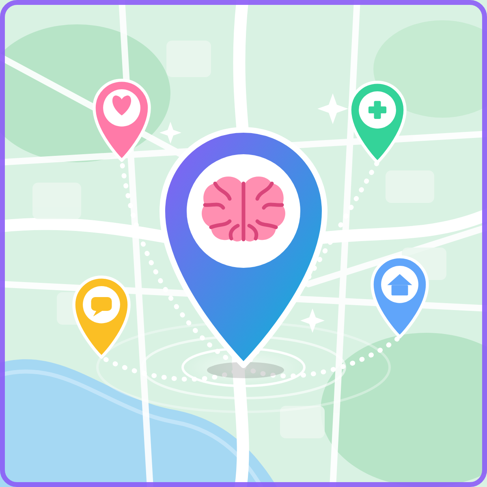

<div align="center">



# Caminhos do Cuidado DF

**Uma ponte entre jovens e a rede pública de saúde mental do Distrito Federal.**


🔗 [**Demo online:**](https://pe-caminhos-do-cuidado-df-4ahth5kvdyeahzum963zry.streamlit.app/)

</div>

---

## 💡 Sobre o projeto

A rede pública de apoio à saúde mental do DF existe e é gratuita, mas muitos jovens não sabem **o que cada serviço faz**, **onde fica** nem **como chegar**. Em paralelo, é comum recorrer a redes sociais e ferramentas de IA para desabafar, por praticidade e medo de julgamento.

O **Caminhos do Cuidado DF** é um protótipo de **mapa-jogo informativo**: o jovem explora os serviços do território, aprende em linguagem simples como acessá-los e cumpre pequenas **missões** educativas que desfazem mitos e apontam o caminho até o cuidado humano e presencial.

> Projeto de extensão da disciplina **Projeto de Inovação e Criatividade** (IESB, 2026/2, Turma 3) · tema norteador: **Saúde Mental**.

## 🤖 Desenvolvimento

Protótipo desenvolvido pela equipe com apoio de IA generativa (Claude, da Anthropic) para a escrita do código e dos textos de apoio.

## ⚠️ Aviso importante

Este projeto é **informativo e educativo**. Ele **não** faz diagnóstico, triagem nem acompanhamento psicológico e **não substitui** profissionais de saúde ou serviços de urgência.

Se você ou alguém próximo está em risco agora:

| Situação | Contato |
|---|---|
| Risco imediato à vida | **SAMU 192** · **Polícia 190** |
| Quero conversar com alguém agora | **CVV 188** (24 h, gratuito) · [cvv.org.br](https://cvv.org.br) |
| Violência contra a mulher | **Ligue 180** |

## ✨ Funcionalidades

- 🗺️ **Mapa de apoio**: serviços por tipo e região, com cartões "o que é / quem pode procurar / como acessar".
- 🎮 **Missões**: seis desafios curtos sobre UBS, mitos do CAPS, documentos, crise de um amigo, uso de IA e rede de proteção à mulher.
- 🆘 **Preciso de ajuda agora**: página de acesso rápido aos canais de urgência.
- ⬇️ **Lista para baixar (CSV)**: versão simples de consulta sem internet.
- 🏳️‍🌈 **Filtro de oferta para população LGBTQIA+**, baseado apenas no que a Carta de Serviços da SES-DF descreve.
- 🔒 **Sem login e sem coleta**: nenhuma resposta do usuário é armazenada.

## 🚧 O que ainda não foi implementado

Registrado de forma transparente, porque faz parte do aprendizado:

- **Tempo de espera por serviço**: não há dado público por unidade; só seria possível com coleta real.
- **Avaliações anônimas de estudantes**: exigem coleta real e moderação, pela sensibilidade do tema.
- **Avaliação do acolhimento** (ex.: serviços amigáveis à população LGBTQIA+): exige relatos reais.
- **Modo offline completo** (aplicativo instalável).
- **Endereços e telefones de parte dos CAPS** (a existência e o tipo vêm da lista oficial da SES-DF, mas endereço e telefone de vários ainda estão marcados como "a confirmar") e **lista de UBS**.

## 📸 Capturas de tela

<!--


-->
_Em breve._

## 🚀 Como rodar localmente

Requisitos: **Python 3.9+** e `pip`.

```bash
# 1. Clone o repositório
git clone https://github.com/Vyenzy/PE-caminhos-do-cuidado-df.git
cd PE-caminhos-do-cuidado-df

# 2. (Opcional, recomendado) crie um ambiente virtual
python -m venv .venv
source .venv/bin/activate        # Windows: .venv\Scripts\activate

# 3. Instale as dependências
pip install -r requirements.txt

# 4. Rode o app
streamlit run app.py
```

O app abre em `http://localhost:8501`.

## 🗂️ Estrutura do repositório

```
PE-caminhos-do-cuidado-df/
├── app.py                  # aplicação Streamlit
├── requirements.txt        # dependências
├── data/
│   └── servicos.csv        # base de serviços (com fonte e data de consulta)
├── scripts/
│   └── validar_dados.py    # confere a integridade do CSV
├── docs/
│   ├── PROJETO.md          # contexto, problema, comunidade e metodologia
│   ├── FONTES.md           # referências e fontes dos dados
│   ├── CHECKLIST_VERIFICACAO.md  # verificação dos endereços pendentes
│   └── screenshots/        # imagens para o README
├── assets/                 # identidade visual (capa)
└── .streamlit/config.toml  # tema e privacidade
```

## 📊 Dados e integridade

Todos os serviços em `data/servicos.csv` carregam **fonte** e **data de consulta**. Regras do projeto:

- ✅ `verificado`: conferido em fonte oficial (principal: [Carta de Serviços da SES-DF](https://info.saude.df.gov.br/wp-content/uploads/2023/10/Carta-de-Servicos-Cidadao.pdf)).
- ⚠️ `confirmar`: existência citada em fonte, mas endereço/telefone pendentes. O app exibe o aviso.
- **Nunca inventar dados.** Sem fonte, não entra.

Antes de cada commit que altere os dados, rode:

```bash
python scripts/validar_dados.py
```

Posições no mapa são **aproximadas** (centro da região administrativa).

## 🧭 Roadmap

- [ ] Completar a lista de CAPS com endereços e telefones verificados
- [ ] Busca de UBS por endereço, integrada a dados abertos do GDF
- [ ] Coleta moderada de avaliações anônimas (com consentimento e revisão)
- [ ] Revisão do conteúdo por profissionais de saúde mental e assistência social
- [ ] Acessibilidade: contraste, leitor de tela e linguagem simples
- [ ] Versão instalável (PWA) com uso offline

## 🌍 ODS relacionados

| ODS | Relação com o projeto |
|---|---|
| **3** · Saúde e Bem-Estar | Informação, prevenção e acesso à saúde mental |
| **5** · Igualdade de Gênero | Visibilidade a canais de proteção e acolhimento à mulher (inclui o PAV Flor de Lótus, em Ceilândia) |
| **16** · Paz, Justiça e Instituições Eficazes | Aproximar pessoas de instituições, direitos e serviços públicos |

## 👥 Equipe

- **Andrew Viana** · [@Andrew777-coder](https://github.com/Andrew777-coder)
- **Yves Pires** · [@Vyenzy](https://github.com/Vyenzy)

Estudantes de Engenharia de Computação, IESB.

## 📄 Licença

Código sob licença [MIT](LICENSE). Os dados dos serviços pertencem às respectivas fontes oficiais citadas.
